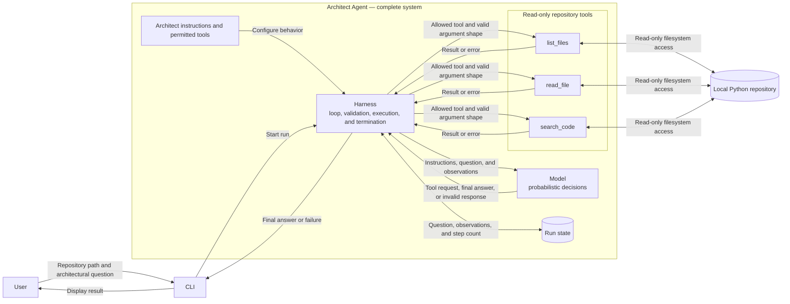

# Phase 0 Workbook — Think Before Coding

Do not research competing products before completing the initial product definition. The point is to make the first mental model your own.

## Block 0.1 — Product definition

Keep each answer to roughly one to three sentences.

### 1. Who is ArchAgent for?

An AI engieneer specializing in AI development but lacks traditional software engineering knowledge. They can write and read python, use git, write code with a coding agent.

### 2. What problem does it solve?

The user can produce working code faster than they can evaluate its structure and architectural risks.

### 3. What information can a user give it?

Given a local python repository and one architectural question.

### 4. What should it produce?

ArchAgent produces an explanatory answer supported by specific repository evidence and identifies relevant risks or uncertainties.

### 5. What explicitly will V0.1 not do?

- It does not determine whether product behavior meets requirements.
- It does not diagnose individual bugs.
- It does not execute or modify the application.

### Challenge notes

After drafting the answers, pressure-test them:

- Is the intended user specific enough to make product decisions? Yes
- Is the problem stated independently of a preferred technology? yes
- Are inputs and outputs concrete enough to recognize success? yes
- Does V0.1 have one coherent job? yes
- Which words are ambiguous and need an operational definition? None

_Notes:_

## Block 0.2 — V0.1 architecture

Draw the architecture yourself. The drawing can be Mermaid, ASCII, or an image linked here.

Your diagram should make it possible to ask:

- Where does execution begin and end?
- Which component owns the loop?
- Which boundaries are deterministic and which involve a model?
- How do tool requests and results cross those boundaries?
- Where does repository access occur?
- What state exists during one run?
- What can fail at each boundary?

_Diagram and notes:_

### Architecture notes

- **Execution begins when:**
  The user provides a local repo and architectural question.
- **Execution ends when:**
  The CLI displays results, either the final answer or controlled failure.
- **The loop is owned by:**
  The harness
- **The probabilistic boundary is:**
  model
- **The deterministic components are:**
  The Harness, cli input handling, run-state management, repository tools.
- **Repository access occurs only through:**
  The tools
- **A repository tool handles a path outside the repository by:**
  The tool resolves the requested path and rejects it without reading the
  file if it is outside the repository root. It returns a controlled error
  to the harness, which records the result and may allow the model to
  continue if the iteration limit has not been reached.
- **Run state contains:**
  - Original question
  - Repository root
  - Model messages
  - Tool requests and results
  - Current iteration count
  - Encountered errors
- **The harness handles a model failure by:**
  A model-service failure may terminate with a controlled error; a retry policy
  can remain undecided.
- **The harness handles an invalid tool request by:**
  The harness rejects unknown tools or malformed arguments without executing
  them. It records the error and returns it to the model as an observation.
- **The harness handles a tool failure by:**
  An ordinary tool failure, such as a missing file, may be returned to the model
  so it can choose another action.
- **The harness prevents an infinite loop by:**
  The harness counts every iteration and ends the run with a controlled failure when the configured maximum iteration count is reached.

## Block 0.3 — Core concepts in ArchAgent

Define each term in the context of this project—not as a textbook definition.

### Agent

_Your definition:_ The complete system that takes the python repository and architectural question, investigates it using permitted read-only tools and gives back an answer to the architectural question providing specific evidence from the repository and relevant risks or uncertainties. If the system cannot complete the investigation, it returns a controlled failure.

### Tool

_Your definition:_ The tool is requested from the harness with defined parameters, it performs its deterministic bounded repository operation. The tools are read-only enforced and can only access the repository root. It returns a result or a controlled error. This is only a
deterministic script and does not reason, call the model or decide the next action.

### Model

_Your definition:_ The model is the probabilistic component of the agent, the harness sends the model instructions, tool observations, and a question to answer, the model can reason and answer, and propose the next action that should be taken. The model does not directly call a tool or another model, it can not directly access the repository. This is a probabilistic function so we cannot guarantee valid responses.

### Harness

_Your definition:_ The harness receives the Python repository path and architectural question from the cli. Then it initializes the run state. Then calls the model with instructions, question, and observations. It validates the model response. From the response it may execute a permitted tool or accept a final answer. The harness records the results and increments the iteration count. It checks the configured iteration limit and returns a controlled failure if the limit has been reached, otherwise, continues, returns the final answer through the CLI or returns a controlled failure.

### Boundary check

Explain how these four concepts differ and where responsibility moves from one to another.

_Your answer:_ To read a file, the agent takes in the repository path and architectural question. The harness notes the path and the tools are only able to read the root-repository given. The model may propose a tool to read a file and send that proposal back to the harness. The harness validates the tool call and if valid calls the tool. the Tool checks if the proposed path is within the given repository path from the user, if it is the file operation is performed and the tool is able to read the file, otherwise the tool call is rejected. The tool sends back results and errors to the harness, the harness can send that to the model and continue the loop. Once the model gives a final answer, the harness recognizes the response as a final answer, validates its expected form, and returns it to the CLI.

## Block 0.4 — Project setup

Only begin this after the earlier Phase 0 exercises have been reviewed.

- [x] Initialize the Git repository
- [ ] Decide the supported Python version
- [ ] Choose an environment and dependency-management approach
- [ ] Add the smallest justified package structure
- [ ] Configure formatting and linting
- [ ] Configure type checking
- [ ] Configure pytest
- [ ] Confirm the checks run from a clean checkout
- [x] Create the ADR directory and template

Before choosing tools, write down what each tool needs to accomplish and what cost or constraint it introduces.
